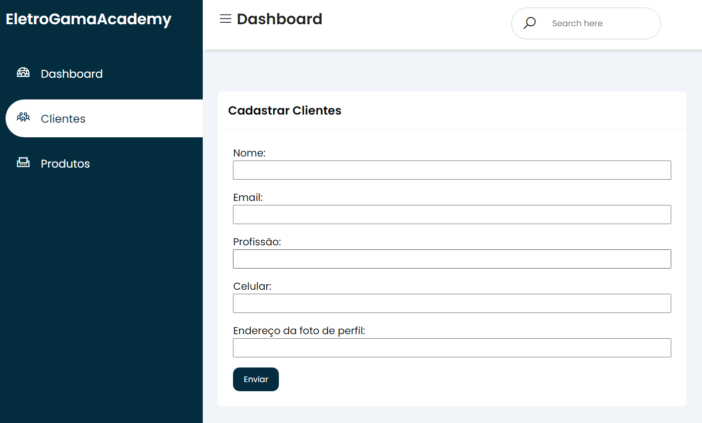
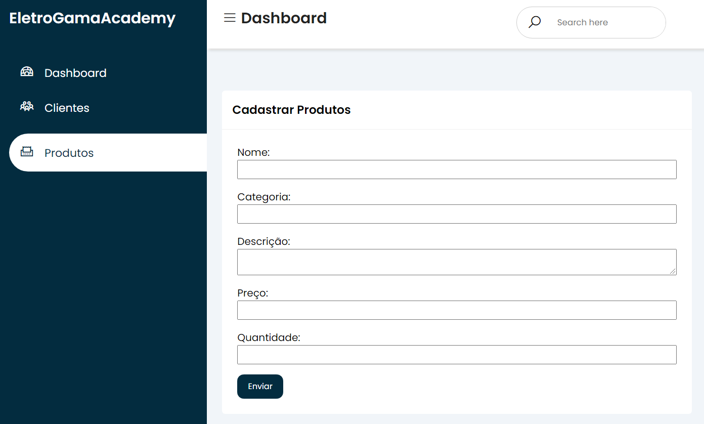
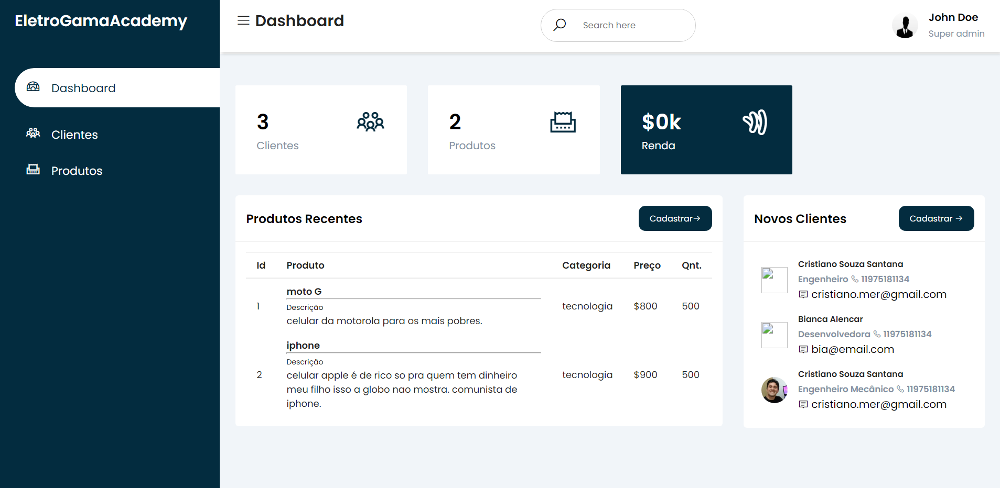

# Hiring Coders & Gama Academy Bootcamp

2° Entrega - Gestão de Cadastros
Criação de um sistema e-commerce para inventário de produtos e dados de clientes:

Entregáveis:

- Os dados de clientes, endereços e produtos devem estar devidamente estruturados
- Dados no localstorage
- Código fonte no github com o arquivo README detalhando as funcionalidades da programação

Cadastro de Clientes:

- Nome
- Email
- profissão
- Numero de Telefone
- Caminho da foto: Ex.: "http:/site/foto.png"

Cadastro de Produtos:

- Nome produto
- Categoria
- Descrição
- Preço
- Quantidade

O Dashboard retorna a quantidade de clientes e produtos, e toda a visualização dos dados.

